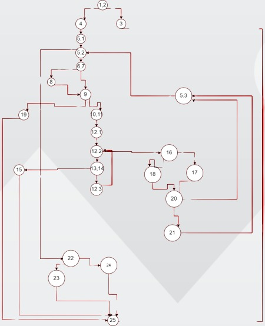
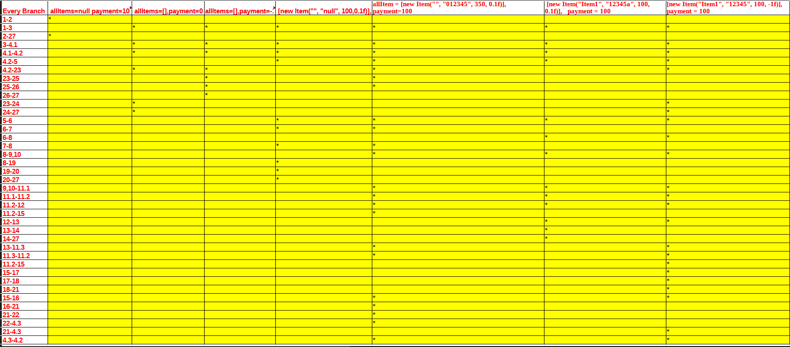

# Втора лабораториска вежба по Софтверско инженерство

## Александар Нечовски, бр. на индекс 223243

###  Control Flow Graph

### Цикломатска комплексност

Цикломатската комплексност на овој код е 10, истата ја добив преку формулата P+1, каде што P е бројот на предикатни јазли. Во случајoв P=9, па цикломатската комплексност изнесува 10.

### Тест случаи според критериумот  Every Branch

....

### Тест случаи според критериумот Multiple Condition
a)1234564,500,0.2f -> TTF

b)1234562,500,0 -> TFF

c)1234012,500,0,3f ->TTF

d)0123,80,0.5f -> FTT

